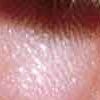

# Thumb

Peter Swire - swirepe.com

## What is it?

It tries to summarize an image based on entropy.  For some reason, lowest entropy (less surprising) seemed to work better than highest entropy.

Before:

After:

## I think reddit does something like that.

[I just learned of this myself.](https://github.com/reddit/reddit/blob/master/r2/r2/lib/media.py#L76)

## Can I use this?

I wrote this in an afternoon, and I don't have any real investment in it.  If it's helpful for you, [let me know?](http://swirepe.com/contact)

